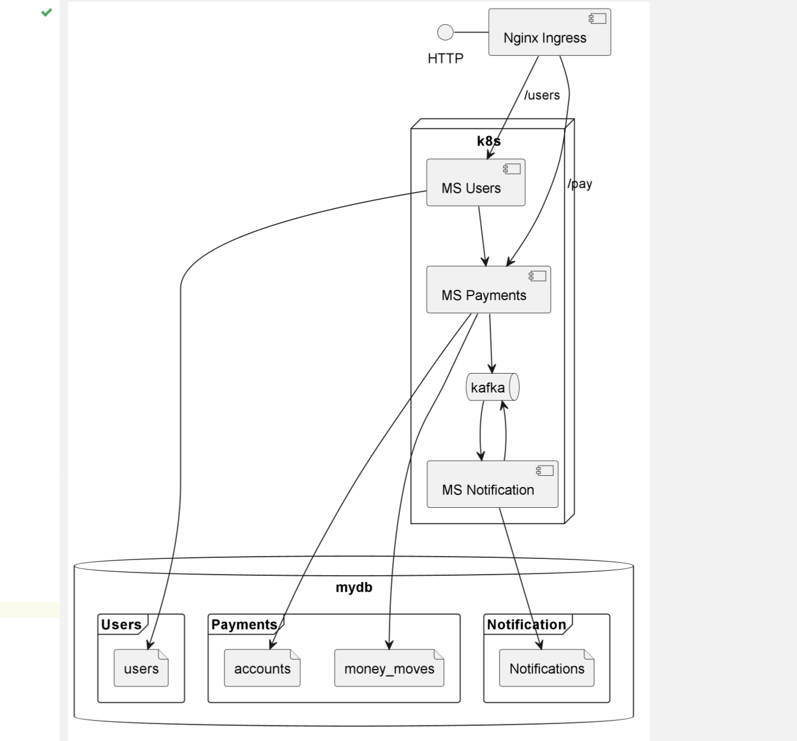
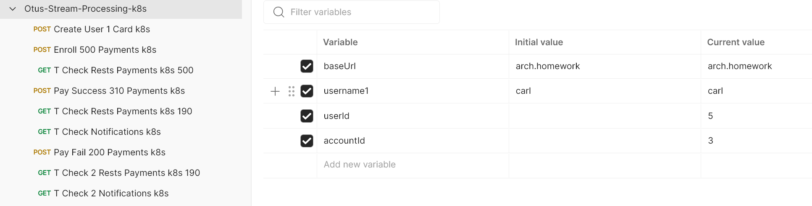

# Otus 09
Stream processing
# Результат выполнения задания
Студент: Дмитриев С.А. Группа OTUS MicroserviceArchitecture-2023-04

## Описание
Домашнее задание №9 использует наработки заданий №7,8.
В том числе сервис Управления Пользователями (wsdb)
Дорабатываю уже написанный сервис Биллинга (payments).

Теперь добавился шаг Уведомление (Notification) и локально развернутый сервис Kafka.
Целью шага является "Послать клиенту email о прохождении/непрохождении оплаты".
После обработки вызова оплаты, сервис Биллинга через брокер сообщений посылает событие сервису Уведомлений.

## Теоретическая часть
SAGA - то есть мы совершаем законченные отдельные операции, но при возникновении ошибки предусмотрено выполнение компенсирующих операций.

## Практическая часть

### Логика работы сервиса
Для этого были созданы 3 микросервиса:
1. Пользователи (users)
1. Оплата (payments)
3. Уведомление (notification)

Все 3и микросервиса размещаю в одном namespace (zipper) кубернетеса.
Главный МС Users и вспомогательный Paymants выведены наружу через Nginx-Ingress, а вспомогательный notification реализован в виде Service типа NodePort. Сервис Users обращается к Payments через внутренние адреса кубернетес (payments-service).
Все 3 сервиса используют для хранения одну общую БД постгрес mydb (разделение на отдельные БД представляется не сложным, но трудозатратным и не влияющим на смысл этой работы).

Для выполнения тестового сценария требуются технические операции (помеченные буквой T). Это операции, которые не должны выполняться через Ingress и использующие прямой доступа к вспомогательным микросервисам: провкерка состояния счета клиента, проверка наличия уведомления. 

### Порядок выполнения тестового сценария
1. Создаём клиента 1 (Create User 1 Card k8s)
2. Пополняем счет клиента 1 на  500 рублей (Enroll 500 Payments k8s)
3. ТО проверяем что у клиента на счете есть 500 руб (T Check Rests Payments k8s 500)
4. Успешно оплачиваем 310 руб (Pay Success 310 Payments k8s)
5. ТО проверяем, что у клиента на счете осталось 190 руб (T Check Rest Payments k8s 190)
6. ТО проверяем, что появилось уведомление об удачной оплате в сервисе Notifiation (T Check Notification k8s)
7. С ошибкой оплачиваем 200 руб (Pay Fail 200 Payments k8s)
8. ТО проверяем, что у клиента на счете осталось 190 руб (T Check 2 Rest Payments k8s 190)
9. ТО проверяем, что появилось уведомление об ошибке при  оплате в сервисе Notifiation (T Check Notification k8s)


## Процесс выполнения:
1. Создал неймспейс zipper
```shell
kubectl apply -f kube-manifest/01_namespace_zipper.yaml
```
2. Установил PostgreSql в неймспейс zipper
```shell
helm install postgresql-test oci://registry-1.docker.io/bitnamicharts/postgresql --set auth.database=mydb,auth.postgresPassword=secretpassword -n zipper
```
3. Написал свой сервис сохранения заказов на Java (my-order-worker-service)
4. Создал секрет для доступа приложения к БД
```shell
kubectl create secret generic db-password --from-literal=password='secretpassword'
```
4. Установил приложение с помощью Helm в неймспейс zipper.
```shell
helm install order-worker-local myapp/. -n zipper
```
5. Написал 3 вспомогательных микросервиса Payment, Warehouse и Delivery.
6. Установил их с помощью Helm.
```shell
helm install payments paym-helm/. --atomic
helm install payments wh-helm/. --atomic
helm install delivery dly-helm/. --atomic
```
5. Сделал коллекцию postman для проверки предложенного сценария (Otus-Saga-k8s.json)
Для тестирования сделал проброс порта:
```shell
kubectl port-forward --namespace nginx-ingress svc/ingress-nginx-controller 8080:80 --address 127.0.0.1,192.168.1.191
kubectl port-forward --namespace zipper svc/payments-service 8010:8010 --address 127.0.0.1,192.168.1.191
kubectl port-forward --namespace zipper svc/warehouse-service 8020:8020 --address 127.0.0.1,192.168.1.191
kubectl port-forward --namespace zipper svc/delivery-service 8030:8030 --address 127.0.0.1,192.168.1.191
```
```shell
newman run Otus-Stream-Processing-k8s.json --verbose
```

Всё.
